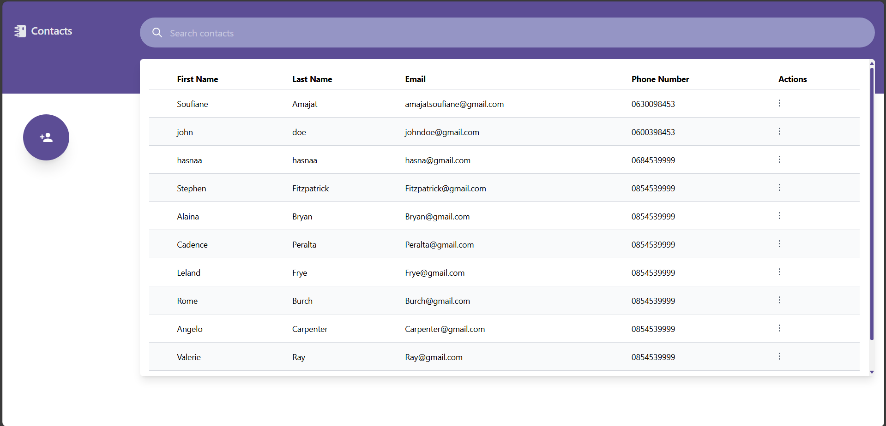
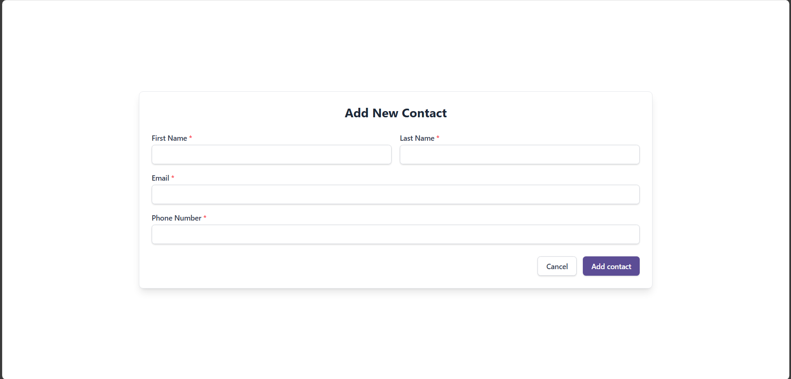
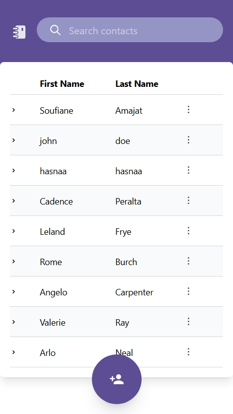

# 📇 Contact Management Application

A **full-stack CRUD** application for managing contacts, developed with **Spring Boot** (backend), **React.js** (frontend), and **PostgreSQL** (database), all containerized using **Docker Compose**. This project emphasizes clean code, modular architecture, and version control best practices.

---

## 📑 Table of Contents

* [Project Overview](#project-overview)
* [Features](#features)
* [Technologies Used](#technologies-used)
* [Project Structure](#project-structure)
* [Setup and Running the Application](#setup-and-running-the-application)

  * [Prerequisites](#prerequisites)
  * [Database Setup (Docker Compose)](#database-setup-docker-compose)
  * [Backend Setup](#backend-setup)
  * [Frontend Setup](#frontend-setup)
  * [Running with Docker Compose](#running-with-docker-compose)
* [API Endpoints](#api-endpoints)
* [Important Notes](#important-notes)

---

## 🧾 Project Overview

This application allows users to **create**, **view**, **update**, and **delete** contacts. It demonstrates:

* A layered backend architecture
* Modern frontend development principles
* REST API design
* Containerized deployment using Docker Compose

---

## 🚀 Features

### 🔙 Backend (Spring Boot)

* **RESTful API**: CRUD operations for contacts
* **Data Persistence**: PostgreSQL with Spring Data JPA (Hibernate)
* **Entity Model**: `Contact` with fields: `firstName`, `lastName`, `email`, `phoneNumber`
* **CRUD Endpoints**:

  * `GET /api/contacts`
  * `GET /api/contacts/{id}`
  * `POST /api/contacts`
  * `PUT /api/contacts/{id}`
  * `DELETE /api/contacts/{id}`
* **Input Validation**
* **Error Handling**
* **CORS Configuration** (for cross-origin requests)

### 🖥️ Frontend (React.js)

* **Responsive UI**: Functional components & hooks
* **State Management**: `useState`
* **Axios** for API interaction
* **Modals** for adding/editing contacts
* **Search Functionality** (by name, email, etc.)

---

## ⚙️ Technologies Used

### Backend:

* Java 17
* Spring Boot 3.3.1
* Spring Data JPA & Hibernate
* PostgreSQL (via Docker)
* Maven

### Frontend:

* React.js
* Vite
* Axios
* Tailwind CSS
* Nginx (in Docker)

### DevOps:

* Docker
* Docker Compose
* Git

---

## 📁 Project Structure

```
.
├── contact-book-backend/
│   ├── src/main/java/org/contacts/
│   │   ├── config/          # WebConfig (CORS)
│   │   ├── controller/      # ContactController
│   │   ├── model/           # Contact.java
│   │   ├── repository/      # ContactRepository
│   │   └── service/         # ContactService
│   ├── src/main/resources/  # application.properties and schema.sql
│   ├── pom.xml
│   └── Dockerfile
├── contact-book-frontend/
│   ├── public/
│   ├── src/
│   │   ├── assets/
│   │   ├── components/
│   │   ├── pages/
│   │   │   └── ContactListPage.jsx
│   │   └── App.jsx
│   │   └── App.css
│   │   └── main.jsx
│   │   └── index.css
│   ├── package.json
│   ├── vite.config.js
│   ├── tailwind.config.js
│   └── Dockerfile
└── docker-compose.yml
```

---

## 🛠️ Setup and Running the Application

### ✅ Prerequisites

Make sure you have:

* Java 17+
* Maven
* Node.js (LTS) + npm
* Docker Desktop (Docker & Docker Compose)

---


### 🧰 Backend Setup

```bash
cd contact-book-backend
mvn clean package
```

> This builds `target/contact-backend.jar` () for Docker.

---


### 🐳 Running with Docker Compose

From root directory (where `docker-compose.yml` is):

```bash
docker compose up -d --build
```

Check containers:

```bash
docker ps
```

Access:

* Frontend: [http://localhost:3000](http://localhost:3000)
* API: [http://localhost:8080/api/contacts](http://localhost:8080/api/contacts)

Stop services:

```bash
docker compose down
```

---

## 🔗 API Endpoints

| Method | Endpoint             | Description                        |
| ------ | -------------------- | ---------------------------------- |
| GET    | `/api/contacts`      | Get all contacts (supports search) |
| GET    | `/api/contacts/{id}` | Get contact by ID                  |
| POST   | `/api/contacts`      | Create new contact                 |
| PUT    | `/api/contacts/{id}` | Update contact by ID               |
| DELETE | `/api/contacts/{id}` | Delete contact by ID               |

---

## Screenshots
To give a quick visual overview of the application, here are some screenshots:

### Contact List Page (Desktop View):


### Add New Contact Modal:



### Contact List Page (Mobile View):


---